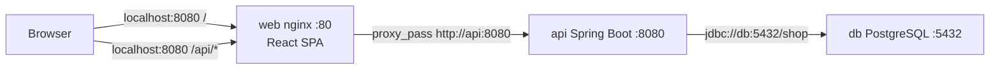
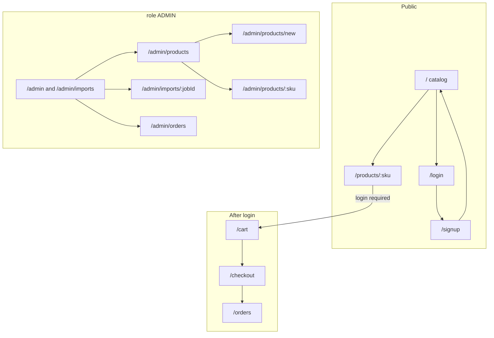
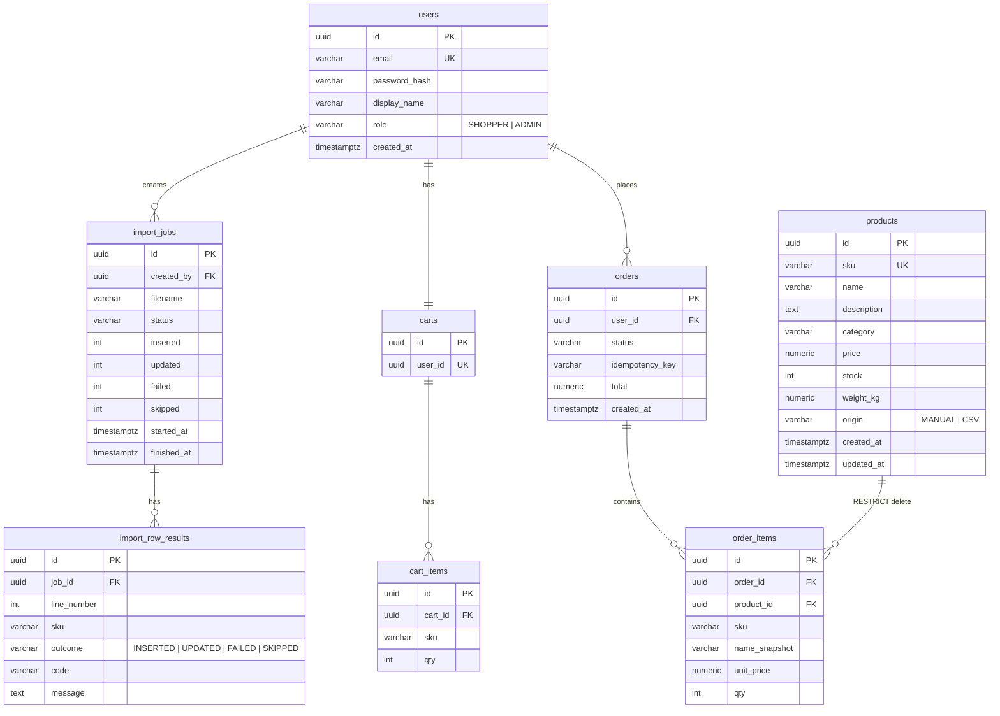
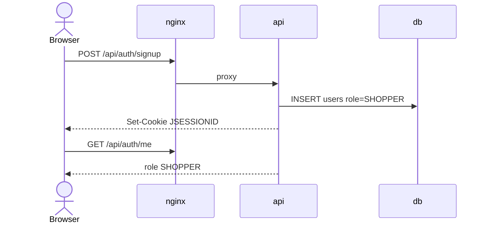
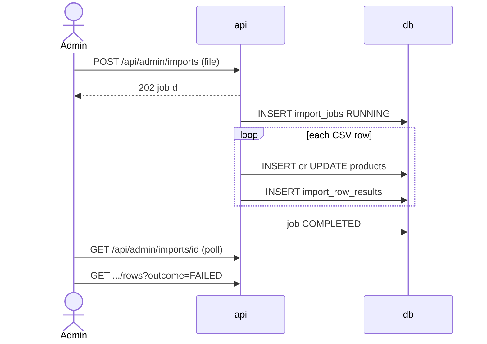
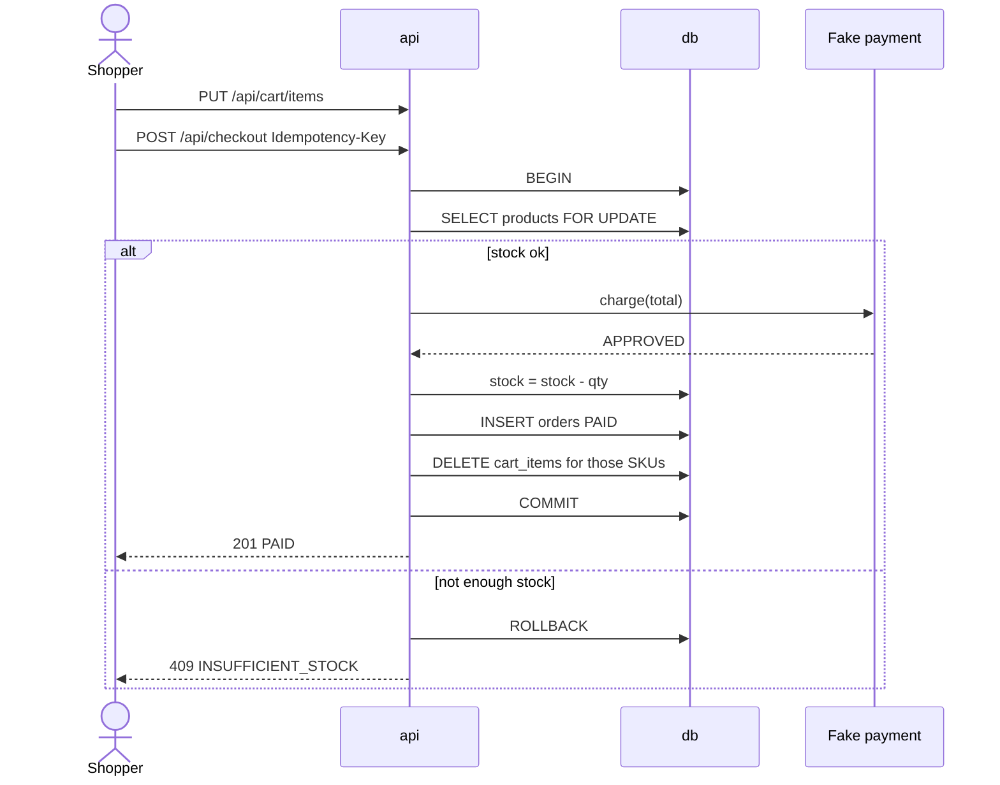
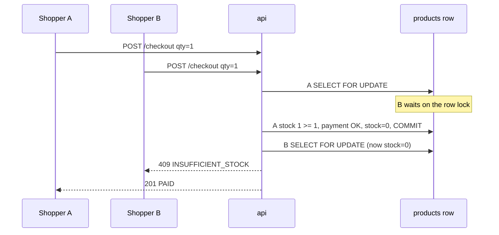
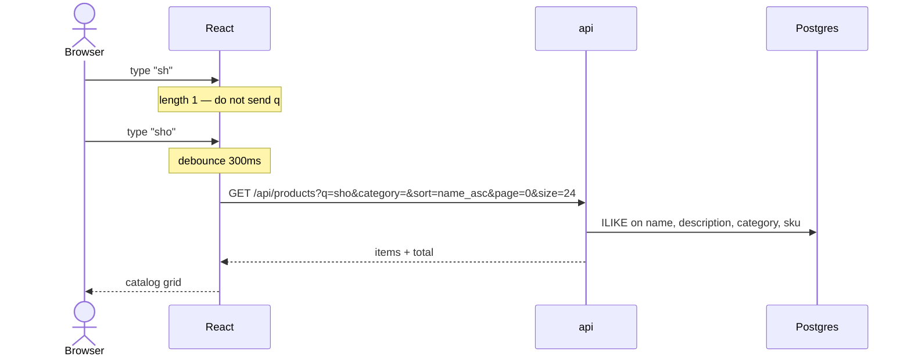
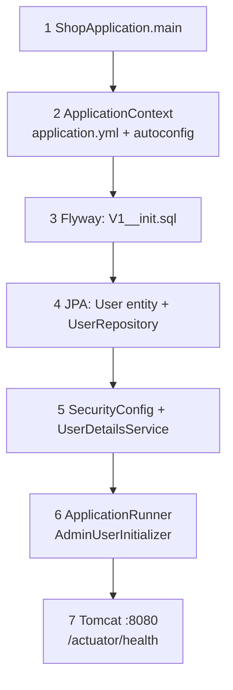

# Diagrams (v1)

Companion to [PLAN.md](PLAN.md) and [SPECS.md](SPECS.md). Open the mermaid blocks in GitHub or any mermaid renderer.

**Auth:** shopper sign up + sign in. Admin is seeded. **No shipping address** in v1.

---

## 1. System (Docker)

Roles are **not** containers. One `api` serves SHOPPER and ADMIN.

---

## 2. Frontend views

`/admin` redirects to **CSV import**. Shopper hitting `/admin` → redirect `/`. Admin can also use the storefront. Header search + category sit on the catalog, not on a second toolbar.

---

## 3. Database: users, roles, permissions

v1 does **not** have `permissions` or `user_roles` join tables. Two values on `users.role` are enough. Permissions are implied in Spring `hasRole`.

Conceptual permissions (code, not a table):

| Role | catalog read | cart/checkout | product write | CSV import |
|---|---|---|---|---|
| anonymous | yes | no | no | no |
| SHOPPER | yes | own | no | no |
| ADMIN | yes | own | yes | yes |

Later: `roles`, `permissions`, `role_permissions` if we have more than two actors.

---

## 4. API flows

### Sign up / sign in

Admin never uses signup. Login with seeded `admin@shop.local`.

### Import CSV

### Checkout (happy path)

---

## 5. Concurrent purchase (last unit)

Product stock = 1. Two shoppers, same SKU, both click Buy.

- Cart is **not** a reservation. Both could have qty 1 in the cart.
- The loser keeps the item in the cart; UI shows the 409 and they must change qty or remove.
- No oversell: lock + `stock >= qty` inside one transaction.
- Same `Idempotency-Key` twice → one order, not two.

**No address step** between cart and pay. Flow: cart → confirm (lines + total) → Buy → fake pay → order. Adding street/zip is fulfillment, not this challenge.

---

## 6. Search (not Elasticsearch)

`q` matches name, description, category, and sku. Category is an exact match in the same header control as search. The API still accepts `sort`; the storefront uses the default `name_asc`. Out-of-stock products still appear. The grid is the search UI (no separate typeahead list).

---

## 7. Extra CSV columns

Header is mapped **by name**. Extra columns (`image_url`, …) are skipped. Missing `sku` / `price` / … → `FAILED_HEADER`.

---

## 8. Spring Boot startup

Flyway runs **before** `AdminUserInitializer`. If SQL fails, the admin is never inserted.

