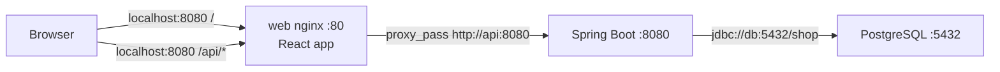

# Gila Store

I built a shop that loads a **dirty comma-separated catalog file (CSV)**, searches those products, and checks out without overselling. Spring Boot 4.1, React, PostgreSQL, one Docker Compose command.

**Example CSV downloaded:** 2026-09-09  
Path: [`fixtures/Code Challenge E-Commerce.csv`](fixtures/Code%20Challenge%20E-Commerce.csv)

---

## Requirements

- [Docker Desktop](https://www.docker.com/products/docker-desktop/) (Engine + Compose v2)
- Free port **8080**
- About 4 gigabytes of memory for the first image build (Maven and Node run inside the images)

You do **not** need Java or Node on the host for the graded path.

---

## Run

```bash
git clone <this-repo>
cd ecommerce
docker compose up --build
```

Open **http://localhost:8080**

Stop with `Ctrl+C` or `docker compose down`. Data lives in the `pgdata` volume (`docker compose down -v` wipes the catalog).

| Who | Email | Password | Notes |
|---|---|---|---|
| Admin | `admin@shop.local` | `admin1234` | Created when the backend starts if no `ADMIN` row exists. **Not** the Postgres password (`shop`). |
| Shopper | (sign up) | (your password) | Sign-up always creates `SHOPPER`. There is no “register as admin”. |

---

## Architecture

The browser talks only to nginx on port 8080. The Spring service and Postgres are not part of the public address.



Shopper and admin are rows in `users`, not extra containers. One Spring service serves both. Hiding `/admin` in React is not authorization — Spring still returns **403**.

Database table diagram, import sequence, and the last-unit checkout race: [DIAGRAMS.md](DIAGRAMS.md). Request and response contract: [SPECS.md](SPECS.md). Design notes: [PLAN.md](PLAN.md). Gaps: [KNOWN_ISSUES.md](KNOWN_ISSUES.md).

---

## Quick walkthrough

### 1. Import their catalog file (admin)

1. Log in as `admin@shop.local` / `admin1234`.
2. **Admin → CSV import** (`/admin/imports`).
3. Drop `fixtures/Code Challenge E-Commerce.csv` (max **2 megabytes**).
4. Open the job. You should see new / updated / failed / skipped — not a silent bulk load into Postgres.

On a fresh database their file is about 97 data rows: most load, a handful **fail** (`$29.99`, `free`, negative stock, empty name/category/weight), two empty rows **skip**, duplicate product codes **update in place** (last row wins, with a warning). Names that look like script tags or database injection are stored as **text**; the storefront must not execute them.

### 2. Search (anyone)

On `/`, the header has category + search as one control. Type at least **2** characters (300 millisecond delay). The `q` query matches name, description, category, and product code. Category works with an empty query. Stock 0 stays listed; Add to cart is disabled.

### 3. Buy without overselling

1. Sign up as a shopper (or shop as admin).
2. Add `{ sku, qty }` — the browser does **not** send prices.
3. Checkout body is empty; the browser sends `Idempotency-Key`. Prices and the total come from **locked product rows**.
4. Fake payment is always `APPROVED` in the same database transaction. Two buyers, stock = 1: one **201 PAID**, one **409** `INSUFFICIENT_STOCK` (the loser keeps the cart line).

This version ends at **PAID**. No shipping address, no pick/pack. Fulfillment would add `orders.status` (`PACKING`, `SHIPPED`) without changing the stock lock.

---

## What I chose

| Choice | Why |
|---|---|
| Spring Boot 4.1 + nginx + Postgres (3 Compose services) | One deploy, one database. I would split catalog and checkout only if their load diverged. |
| Postgres `ILIKE` | About 90 products after import. OpenSearch when the catalog is huge or facets matter. |
| `BigDecimal` / `numeric(12,2)` | Money. |
| Apache Commons CSV, columns **by name** | Their file has quoted commas. Extra columns ignored. |
| Reject `$29.99` and `free` | Validation test, not a currency policy. |
| Update by product code, last row wins + warning | `RS-001` / `BS-021` look like updates, not accidents. |
| `import_jobs` + per-row outcomes | The admin can read new vs updated vs failed without re-opening the file. |
| Script and injection strings stored as text | Rendering test. The storefront encodes; JPA uses parameters, not string-built queries. |
| Lock stock at checkout (`SELECT FOR UPDATE`) | The cart is not a reservation. An abandoned-cart expiry timer is a second product. |
| Fake pay always APPROVED, same transaction | A real payment provider would leave the order `PENDING` until the webhook, then decrement. |
| Session cookie, not a JSON Web Token | Browser and Spring share the same origin through nginx. |
| Seeded admin; sign-up → `SHOPPER` only | No self-register as admin. |
| No shipping address | Stock and fake pay, not fulfillment. |
| Flyway, not `ddl-auto` | Repeatable schema in Docker. |
| Image from name / product code + stylesheet fallback | The catalog file has no photos. |

Defaults I picked where the spec was open: last-wins on duplicate product code; ignore extra file columns; no guest checkout; a sold product code cannot be deleted (409); search fields = name, description, category, product code.

I used an assistant. There are **no generated comments** in source.

---

## If this grows

This version already has seams so growth is not a rewrite: streaming file + job table, `202` + poll, `catalog` / `commerce` packages, checkout locks, idempotency key.

| If this happens | Then | Not before |
|---|---|---|
| Catalog file is tens of megabytes | Queue worker; object storage; same report screen | Kafka “because enterprise” |
| Catalog is huge and `ILIKE` hurts | Postgres full-text search / `pg_trgm`, **then** OpenSearch | Elasticsearch on day 1 |
| Hot product-code lock waits | Reservations for those products only | Hold stock on every add-to-cart |
| Real images | `image_key`, object storage, short-lived download links, a content delivery network | LocalStack in the take-home |
| Real money | Payment provider + webhook; never decrement on a browser “success” | Fake pay forever |
| Catalog and checkout scale apart | Extract `catalog` (it owns stock) + outbox | Four services on day 1 |

Left out on purpose: tax, coupons, variants, multi-warehouse, cart expiry, Kubernetes, Magento, recommendations, cross-site request-forgery tokens on another origin ([KNOWN_ISSUES.md](KNOWN_ISSUES.md)).

---

## Local without Docker (optional)

The intended run path is Compose. For storefront iteration only:

- Java 21 + Maven, Node 22, Postgres 16 (`shop` / `shop` / `shop` on `:5432`)
- Backend: `cd services/api && mvn spring-boot:run` (Tomcat `:8080`)
- Storefront: `cd services/web && npm ci && npm run dev` (Vite `:5173`, proxies `/api`)

Do not run host Spring and nginx on **8080** at the same time.
